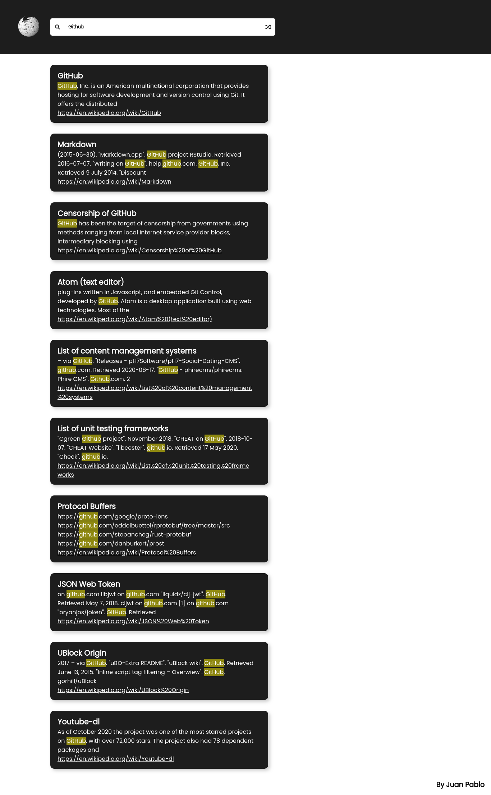

# Wikipedia Search Engine

## 👨‍💻 About the developer

<h4 align="left">
    by <a href="https://www.linkedin.com/in/juanpablodev/" target="_blank">Juan Pablo</a>
</h4>

## :bookmark: About the project

<strong>Wikipedia Search App<strong> with JavaScript

- Click here to access: [Wiki Search](https://juanpabllo.github.io/Wiki-Search/)

## 🚀 Technologies used

This project was developed with the following technologies:

- [Javascript](https://developer.mozilla.org/en-US/docs/Web/JavaScript)
- [API wikipedia](https://en.wikipedia.org/w/api.php)
- [HTML](https://developer.mozilla.org/en-US/docs/Web/HTML)
- [CSS](https://developer.mozilla.org/en-US/docs/Web/CSS)

## Screenshot

---

## To do:

- [ ] Show a progress indicator while the request is processing.
- [ ] Add search suggestions in the search bar, when the user is typing.
- [ ] Display results on more than one page.

## :memo: License

This project is under MIT license.

<h4 align="center">
    by <a href="https://www.linkedin.com/in/juanpablodev/" target="_blank">Juan Pablo</a>
</h4>
